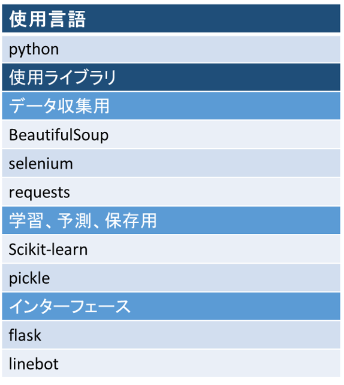
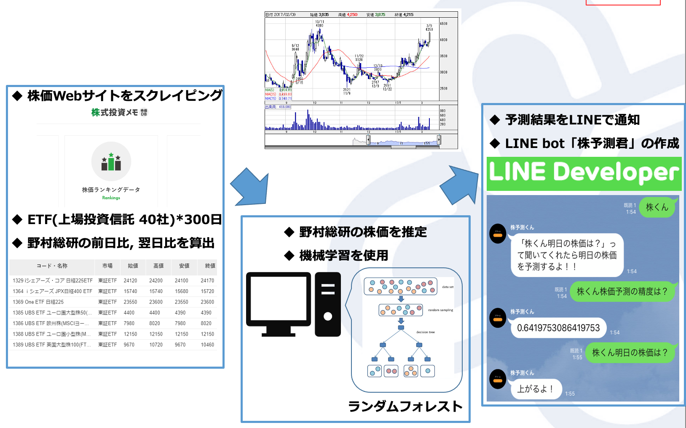

# stock-bot

## 目的
スクレイピングでデータ収集、機械学習で解析、チャットボットによるユーザインタフェースの開発など、一通りのシステム開発の理解をするため。

## 構成

野村総研の株価を予測
ETF（上場投資信託）のデータを利用

1. スクレイピングにて株価データを取得
    - 株式投資メモというサイトから300日分、上場投資信託40社のデータを取得
    - scraping.py

2. 機械学習を用いて学習、予測
    - ランダムフォレストを用いて学習
    - randomClass.py

3. 予測結果を表示
    - LINE Botを利用
    - line_bot.py

## 環境

## システム構成

## 性能評価

### 株価予測精度
1. データ整形なしの精度
2. パラメータ最適化後の精度
3. 影響度が低い特徴量を除いたときの精度

|1|2|3|
|:--:|:--:|:--:|
| 63% | 69% | 66% |

### 実行速度
1. 学習モデルを保存しなかった際の実行速度
2. 学習モデルを保存した際の実行速度

|1|2|
|:--:|:--:|
|2.7210[sec]|0.12867[sec]|

